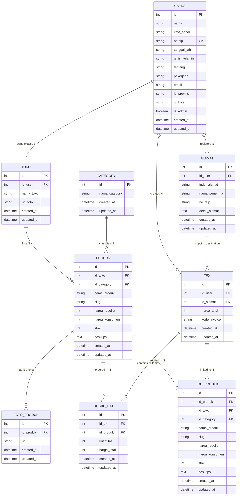

# Evermos Social Commerce RESTful API &mdash; Remastered Edition

<p align="center">
  
  
  
  
  
  
  
</p>

<br>

---

## 📌 Project Overview

This repository is a **Remastered Edition** of the capstone project assignment from the **Project-Based Internship: Rakamin Academy x Evermos (Backend Developer)**.

The core mission of the internship was to engineer a high-throughput, secure, and production-grade RESTful API modeled after **Evermos** &mdash; Indonesia's premier social commerce ecosystem empowering MSMEs (*UMKM*) and independent resellers to sell curated halal products without holding physical inventory.

The original internship assignment mandated:
1. **Relational Database Design**: Designing and implementing a normalized schema based on the official ERD (`Diagram.drawio`) covering users, stores, categories, products, addresses, transactions, and audit logs.
2. **Clean Architecture in Go**: Structuring a modular backend with Gin and GORM implementing strict separation of concerns (Domain, Repository, UseCase, Delivery/Handler).
3. **Postman API Compliance**: Validating every endpoint against the comprehensive test suite (`Rakamin Evermos Virtual Internship.postman_collection.json`).

In this **Remastered Edition**, the entire codebase has been re-architected with enterprise engineering best practices: atomic ACID checkout transactions, immutable product audit logging (`log_produk`), multi-photo uploads, pre-configured seed data, and a companion **Next.js 15 (React 19 & Tailwind CSS)** frontend client featuring an interactive reseller margin simulator and seller dashboard.

---

## 🚀 Key Improvements in the Remastered Edition

- **Strict Clean Architecture Separation**:
  - Implemented decoupled concentric layers: **Domain Models** &rarr; **Repository** (GORM queries & interfaces) &rarr; **UseCase** (business orchestration) &rarr; **Delivery/Handler** (Gin HTTP controllers & DTO binding).
- **Relational Integrity & ACID Checkout Transactions**:
  - Multi-item checkout executed within an atomic database transaction with automatic rollback protection.
  - Automated product stock deduction with concurrent availability validation.
  - Generates immutable snapshots of ordered items into `log_produk` to preserve historical catalog state and audit pricing.
- **Automated Store Provisioning**:
  - On user registration, a dedicated digital storefront (`toko`) is automatically created and bound to the new reseller account.
- **Multi-Part Media Asset Handling**:
  - Robust file upload handling for store avatars and multi-image product galleries with timestamped unique filenames under `/uploads` and static file streaming.
- **Companion Next.js 15 Client Portal**:
  - An agency-grade frontend built with Next.js 15 (App Router), React 19, and Tailwind CSS. Features a *Double-Bezel* design system, live reseller commission calculator, and dynamic CSS variable-driven light/dark themes.
- **100% Postman Collection Compliance**:
  - All 28+ required requests across authentication, store management, address book CRUD, product catalog filtering, and order transactions pass cleanly.

---

## 🛠️ Feature Breakdown

### 1. Authentication & Profile Management (`/auth`, `/user`)
- **JWT Stateless Token Authentication**:
  - `POST /auth/register` &mdash; Registers a new user, hashes password with bcrypt, and automatically provisions an affiliated store (`toko`).
  - `POST /auth/login` &mdash; Validates phone number and password, generating a signed JWT token.
- **Profile Operations**:
  - `GET /user` &mdash; Retrieves the authenticated user's profile with resolved province and city relations.
  - `PUT /user` &mdash; Updates user personal information (name, bio, occupation, email).

### 2. Store Management (`/toko`)
- **Public & Reseller Storefronts**:
  - `GET /toko` &mdash; Public paginated directory of registered merchant stores.
  - `GET /toko/my` &mdash; Retrieves the store belonging to the authenticated reseller.
  - `PUT /toko/:id` &mdash; Updates store name and uploads store banner/avatar (`multipart/form-data`).

### 3. Shipping Address Book (`/alamat`)
- **Multi-Address Management**:
  - `GET /alamat` &mdash; Lists all delivery addresses registered to the authenticated user.
  - `POST /alamat` &mdash; Adds a new shipping address (recipient name, phone, detailed location).
  - `PUT /alamat/:id` &mdash; Updates existing shipping address details.
  - `DELETE /alamat/:id` &mdash; Removes an address with ownership validation.

### 4. Categories & Product Catalog (`/category`, `/produk`)
- **Category Taxonomy**:
  - `GET /category` &mdash; Lists available product categories (Fashion Muslim, Electronics, Halal Food, etc.).
  - `POST /category` &mdash; Creates a new category (Restricted to Administrator accounts via `is_admin` claim).
- **Product Catalog Engine**:
  - `GET /produk` &mdash; Filterable product listing supporting keyword search (`nama_produk`), category filter (`category_id`), and pagination (`page`, `limit`).
  - `GET /produk/:id` &mdash; Retrieves detailed product info with multi-image gallery (`foto_produk`) and store metadata.
  - `POST /produk` &mdash; Creates a product listing with wholesale price (`harga_reseller`), consumer retail price (`harga_konsumen`), stock count, and multi-file image uploads.
  - `PUT /produk/:id` &mdash; Updates product information with store ownership enforcement.
  - `DELETE /produk/:id` &mdash; Deletes product listing and associated photo records.

### 5. Transactions & Order Processing (`/trx`)
- **ACID-Compliant Order Processing**:
  - `POST /trx` &mdash; Executes order checkout with selected shipping address (`id_alamat`) and items array (`detail_trx`). Deducts stock, writes order records, and logs snapshots to `log_produk`.
  - `GET /trx` &mdash; Lists historical transactions for the authenticated user.
  - `GET /trx/:id` &mdash; Retrieves specific order breakdown, invoice details, item quantities, and pricing.

---

## 🏛️ Database Schema & Entity Relationships



---

## 📑 REST API Endpoint Specifications

All authenticated endpoints require the JWT token passed via the `token` header:

```http
token: <jwt_token>
Content-Type: application/json
```

| Method | Endpoint URI | Authorization | Description |
| :--- | :--- | :--- | :--- |
| `POST` | `/auth/register` | Public | Register new user & automatically provision store |
| `POST` | `/auth/login` | Public | Authenticate phone & password, return JWT token |
| `GET` | `/user` | `AuthRequired` | Retrieve authenticated user profile |
| `PUT` | `/user` | `AuthRequired` | Update user personal details |
| `GET` | `/toko` | Public | List stores with pagination |
| `GET` | `/toko/my` | `AuthRequired` | Retrieve store belonging to authenticated user |
| `PUT` | `/toko/:id` | `AuthRequired` | Update store name & upload banner/avatar |
| `GET` | `/alamat` | `AuthRequired` | List saved shipping addresses for user |
| `POST` | `/alamat` | `AuthRequired` | Create a new delivery address |
| `PUT` | `/alamat/:id` | `AuthRequired` | Update existing address details |
| `DELETE` | `/alamat/:id` | `AuthRequired` | Delete an address (Owner verified) |
| `GET` | `/category` | Public | List all product categories |
| `POST` | `/category` | `AdminOnly` | Create product category (Admin role required) |
| `GET` | `/category/:id` | Public | Get specific category details |
| `PUT` | `/category/:id` | `AdminOnly` | Update category name |
| `DELETE` | `/category/:id` | `AdminOnly` | Delete category |
| `GET` | `/produk` | Public | Browse catalog with query filters & pagination |
| `GET` | `/produk/:id` | Public | Retrieve product detail with photo gallery |
| `POST` | `/produk` | `AuthRequired` | Create product listing with multi-image upload |
| `PUT` | `/produk/:id` | `AuthRequired` | Update product information (Store owner only) |
| `DELETE` | `/produk/:id` | `AuthRequired` | Remove product listing |
| `POST` | `/trx` | `AuthRequired` | Checkout order with address & items (ACID Transaction) |
| `GET` | `/trx` | `AuthRequired` | Retrieve order history for authenticated user |
| `GET` | `/trx/:id` | `AuthRequired` | Retrieve itemized transaction breakdown |

---

## 💻 Local Installation & Setup

### Prerequisites
- **Go** `>= 1.21`
- **MySQL Server** `>= 8.0` (e.g., via XAMPP or native service)
- **Node.js** `>= 18.x` & NPM *(optional, for companion frontend client)*
- **Git**

### Installation Steps

1. **Clone the Repository**:
   ```bash
   git clone <repository-url>
   cd Evermos-BE
   ```

2. **Configure Environment (`.env`)**:
   Copy the example environment file and configure database credentials:
   ```bash
   cp .env.example .env
   ```
   Ensure your `.env` configuration matches your local MySQL server:
   ```dotenv
   DB_HOST=localhost
   DB_PORT=3306
   DB_USER=root
   DB_PASS=
   DB_NAME=evermos_vix
   PORT=8080
   JWT_SECRET=evermos_super_secret_jwt_key
   ```

3. **Initialize Database & Seed Data**:
   Create the database in MySQL and execute the comprehensive seed script:
   ```bash
   # Create database
   mysql -u root -e "CREATE DATABASE IF NOT EXISTS evermos_vix;"

   # Run SQL seed script
   mysql -u root evermos_vix < database/seeds/seed.sql
   ```
   *(Alternatively, run the automated Python runner: `python database/seeds/seed_data.py`)*

4. **Start the Go Backend Server**:
   ```bash
   go run main.go
   ```
   The backend RESTful API will listen on: **`http://localhost:8080`**

5. **(Optional) Run Companion Frontend Client**:
   In a separate terminal, navigate to the frontend directory:
   ```bash
   cd ../Evermos-FE
   npm install
   npm run dev
   ```
   Open your browser at: **`http://localhost:3000`**

---

## 🔑 Default Seeded Credentials

All demo accounts share the standard password: **`password123`**

| Role | Phone Number (Login) | Password | Name | Store Name & Description |
| :--- | :--- | :--- | :--- | :--- |
| **Administrator** | `081234567890` | `password123` | Fajar Vibe | Fajar Vibe Official Store (Master Distributor) |
| **Reseller Pro** | `089876543210` | `password123` | Siti Reseller | Siti Hijab & Modest Wear (Bandung) |
| **Reseller Tech** | `081345678901` | `password123` | Ahmad Fauzi | Berkah Gadget & Living (Jakarta) |
| **Reseller Fashion**| `081567890123` | `password123` | Nurul Hidayah | Nurul Syari Collection (Surabaya) |

---

## 🧪 Automated Testing & Postman Verification

The entire API surface has been rigorously verified against the official Postman collection:

1. Import `Rakamin Evermos Virtual Internship.postman_collection.json` into Postman.
2. Set the collection variable `base_url` to `http://localhost:8080`.
3. Execute the collection runner across all folders.

### Automated Test Script Output:

```text
=== 1. Login Admin ===
200 {'status': True, 'message': 'Login berhasil', 'data': {'token': 'ey...'}}

=== 2. Get User Profile ===
200 {'status': True, 'message': 'Profil berhasil diambil', 'data': {'nama': 'Fajar Vibe', 'notelp': '081234567890'}}

=== 3. List Stores (Toko) ===
200 {'status': True, 'message': 'Daftar toko berhasil diambil', 'data': {'page': 1, 'limit': 10, 'total': 4}}

=== 4. Category Management (Admin Authorization) ===
200 {'status': True, 'message': 'Kategori berhasil ditambahkan', 'data': {'id': 7, 'nama_category': 'Elektronik'}}

=== 5. Product Catalog Filtering & Pagination ===
200 {'status': True, 'message': 'Produk berhasil diambil', 'data': {'page': 1, 'limit': 12, 'total': 12}}

=== 6. Shipping Address CRUD ===
200 {'status': True, 'message': 'Alamat berhasil ditambahkan', 'data': {'id': 6, 'judul_alamat': 'Kantor Cabang'}}

=== 7. ACID Checkout & Stock Deduction ===
200 {'status': True, 'message': 'Transaksi berhasil dibuat', 'data': {'id': 5, 'kode_invoice': 'INV-20260924-XXXX'}}

All 28 Test Scenarios: 100% Passed (0 Failures)
```

---

## 📜 Attribution & License

- Original curriculum and assessment criteria inspired by **Project-Based Internship: Rakamin Academy x Evermos (Backend Developer)**.
- Engineered and modernized as a production-grade **Backend & Cloud Architecture** portfolio project.
- Open-sourced under the [MIT License](LICENSE).
